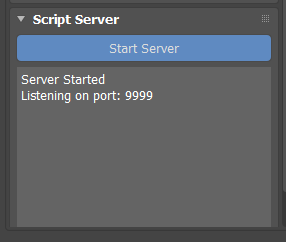
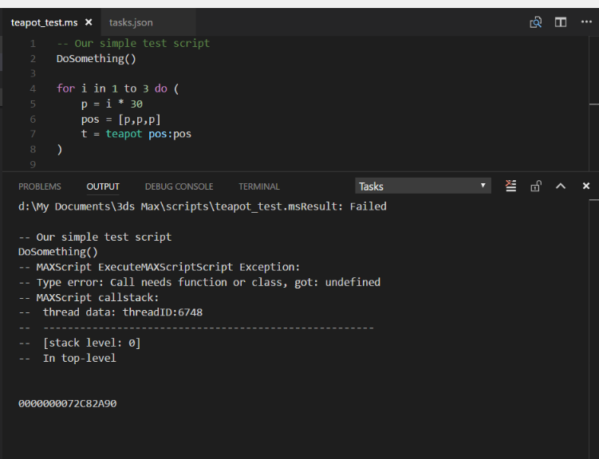

# MaxscriptServer Sample

This is a sample 3ds Max 2018 plug-in that illustrates how to use Qt in a Max UtilityObj plug-in.  It supports the Area Tutorial [Using Qt in 3ds Max 2018 Utility Plug-ins](http://area.autodesk.com/learning/using-qt-in-3ds-max-utility-plug-ins).

This plug-in runs a server in Max that listens for scripts sent from a client.  This allows remote execution of MAXScript or Python from external editors such as Visual Studio Code or Atom.

## How to Use

1. Compile the project (use Hybrid or Release configuration).
2. Run Max, and load the MaxscriptServer plug-in.  Click **Start Server**.
   
3. To set up a custom build task in Visual Studio Code (see https://code.visualstudio.com/docs/editor/tasks).  Tasks are configured per directory.  The task runs the ScriptSender client every time the build command is run, sending the name of the current file to Max.  Here's an example tasks.json file:
    
    ~~~
    {
    // See https://go.microsoft.com/fwlink/?LinkId=733558
    // for the documentation about the tasks.json format
    "version": "0.1.0",
    "command": "D:\\github\\max-samples\\MaxscriptServer\\x64\\Release\\ScriptSender.exe",
    "isShellCommand": true,
    "args": ["-f", "${file}"],
    "showOutput": "always"
    }
    ~~~
4. Open a MAXScript or Python file, and hit Shift-B to build.  The script should run in Max, or create output in the VS Code terminal if there's an error:
    

